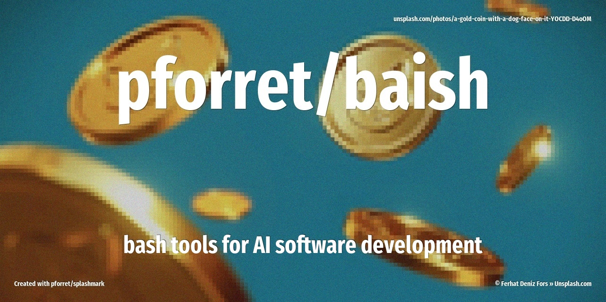

[](https://www.basher.it/package/)

# pforret/baish



Bash tools for AI agents - utilities for working with LLMs from the command line.

## Features

- **Token Estimation**: Estimate LLM token counts offline without API calls
- **Syntax-Aware**: Optimized formulas for prose, code, shell scripts, markup, and data formats
- **Zero Dependencies**: Pure bash implementation, works anywhere
- **Fast**: No network calls, instant results

## 🔥 Usage

```
Program : baish  by peter@forret.com
Version : v0.0.1
Purpose : bash tools for AI agents
Usage   : baish [-h] [-Q] [-V] [-f] [-L <LOG_DIR>] [-T <TMP_DIR>] [-s <syntax>] <action> <input?>

Flags, options and parameters:
    -h|--help        : [flag] show usage [default: off]
    -Q|--QUIET       : [flag] no output [default: off]
    -V|--VERBOSE     : [flag] also show debug messages [default: off]
    -f|--FORCE       : [flag] do not ask for confirmation (always yes) [default: off]
    -L|--LOG_DIR <?> : [option] folder for log files
    -T|--TMP_DIR <?> : [option] folder for temp files
    -s|--syntax <?>  : [option] syntax type for token estimation [default: auto]
                       options: auto, prose, code, shell, markup, data
    <action>         : [choice] action to perform
                       options: tokens, check, env, update
    <input>          : [parameter] input file or text (optional)
```

## Token Estimation

The `tokens` command estimates the number of LLM tokens in text, optimized for different content types.

### Basic Usage

```bash
# From a file (auto-detects syntax from extension)
baish tokens document.txt
baish tokens script.py
baish tokens data.json

# From text parameter
baish tokens "Hello world, this is a test"

# From stdin
echo "The quick brown fox" | baish tokens -
cat README.md | baish tokens -

# With verbose output (shows formula and breakdown)
baish -V tokens document.txt
```

### Syntax Types

The `--syntax` option selects optimized formulas for different content types:

| Syntax | Extensions | Chars/Token | Best For |
|--------|------------|-------------|----------|
| `auto` | (detected) | varies | Default - detects from file extension |
| `prose` | txt, md, rst | 4.3 | Natural language, documentation |
| `code` | py, js, ts, go, rs, php, java | 3.8 | Programming languages |
| `shell` | sh, bash, zsh, ps1, bat | 2.8 | Shell scripts (many special chars) |
| `markup` | html, css, xml, vue, jsx | 3.0 | HTML, CSS, XML templates |
| `data` | json, csv, yaml, toml, ini | 3.0 | Structured data formats |

### Override Auto-Detection

```bash
# Force prose mode on a code file
baish -s prose tokens script.py

# Force code mode on a text file
baish -s code tokens output.log

# Force data mode for better JSON estimation
baish -s data tokens api_response.txt
```

### Accuracy

Benchmarked against OpenAI's tiktoken (GPT-4):

| Content Type | Accuracy |
|--------------|----------|
| Prose/text | ~99% |
| Python/JS/Go | ~95% |
| Shell scripts | ~79% |
| JSON/YAML | ~65% |
| CSV | ~53% |

The estimation works best for natural language and code. Structured data formats with many delimiters have lower accuracy but still provide useful estimates.

### Algorithm

The token count is estimated using:

```
tokens = (characters / chars_per_token + words * word_multiplier) / 2
```

Where `chars_per_token` and `word_multiplier` are tuned for each syntax type based on benchmark data against actual tokenizers.

## ⚡️ Examples

```bash
# Estimate tokens in a file
baish tokens README.md
# Output: 847

# Verbose mode shows details
baish -V tokens README.md
# Output:
# Syntax type: prose
# Characters: 3847
# Words: 612
# Lines: 89
# Formula: chars/4.3 + words*1.33 / 2
# Estimate (chars/4.3): 895
# Estimate (words*1.33): 814
# 847

# Estimate tokens for a prompt
baish tokens "Explain quantum computing in simple terms"
# Output: 8

# Process multiple files
for f in src/*.py; do
  echo "$f: $(baish tokens "$f") tokens"
done

# Check total tokens in a codebase
find . -name "*.py" -exec cat {} \; | baish tokens -
```

## 🚀 Installation

### With [basher](https://github.com/basherpm/basher)

```bash
basher install pforret/baish
```

### With git

```bash
git clone https://github.com/pforret/baish.git
cd baish
./baish.sh tokens "test"
```

### Direct download

```bash
curl -sL https://raw.githubusercontent.com/pforret/baish/main/baish.sh -o baish.sh
chmod +x baish.sh
./baish.sh tokens "test"
```

## Benchmarking

The `benchmarks/` folder contains test files and a benchmark script to compare token estimation accuracy:

```bash
cd benchmarks
./benchmark.sh
```

This compares `baish tokens` against:
- **tiktoken**: OpenAI's official tokenizer (`pip install tiktoken-cli`)
- **Anthropic API**: Claude's token counting endpoint (requires `ANTHROPIC_API_KEY`)

## Configuration

Create a `.env` file for API keys (used by benchmark script):

```bash
# .env
ANTHROPIC_API_KEY=sk-ant-api03-...
```

## Other Commands

```bash
# Check script configuration
baish check

# Generate example .env file
baish env > .env

# Update to latest version (if installed via git)
baish update
```

## 📝 Acknowledgements

* Script created with [bashew](https://github.com/pforret/bashew)
* Token estimation based on research from [OpenAI](https://help.openai.com/en/articles/4936856-what-are-tokens-and-how-to-count-them) and [tiktoken](https://github.com/openai/tiktoken)

## License

MIT License - see [LICENSE](LICENSE)

&copy; 2025 Peter Forret
